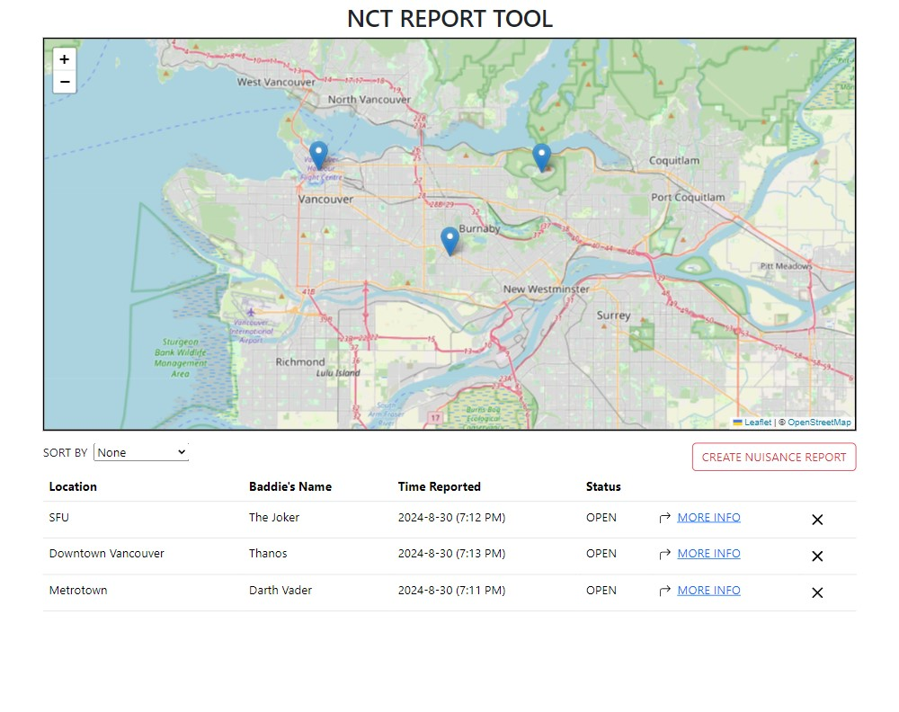
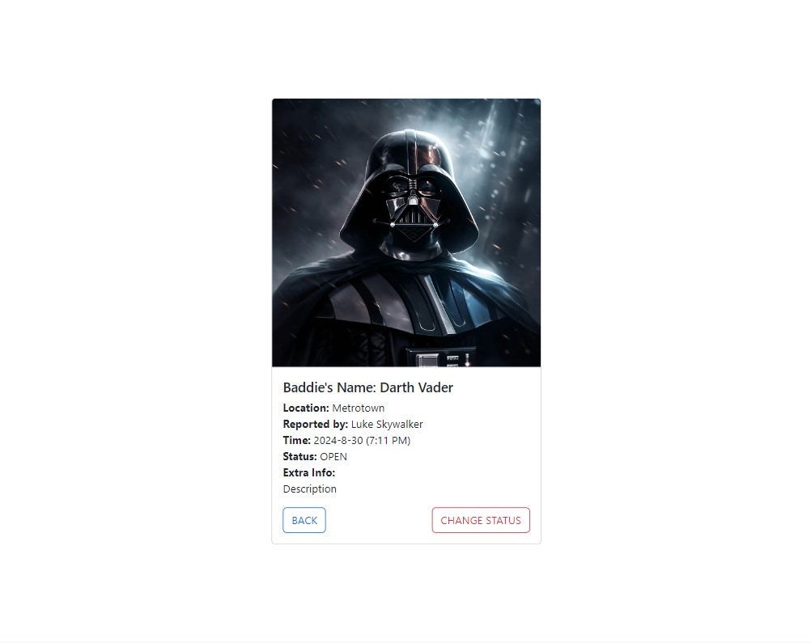
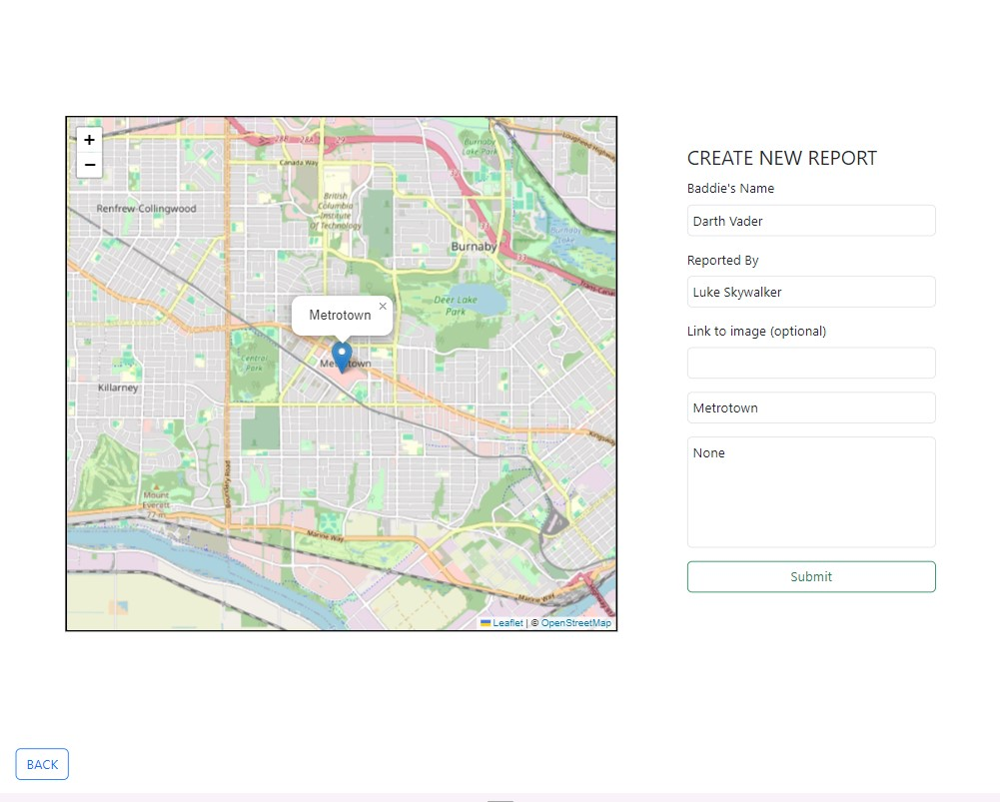

# NCT Report Tool

This project was generated with [Angular CLI](https://github.com/angular/angular-cli) version 16.2.9.

## Project Description

The NCT Report Tool is a web application developed for users to report villains or bad guys in Metro Vancouver and manage the status of the reports.

## Features

- Report Villains: Users can submit reports about villains or bad guys in Metro Vancouver.
- Open and Close Reports: Users can open new reports and close existing reports with a password based on the status of the villain.
- User-friendly Interface: The application provides an intuitive and easy-to-use interface for reporting and managing villains.

## Images

